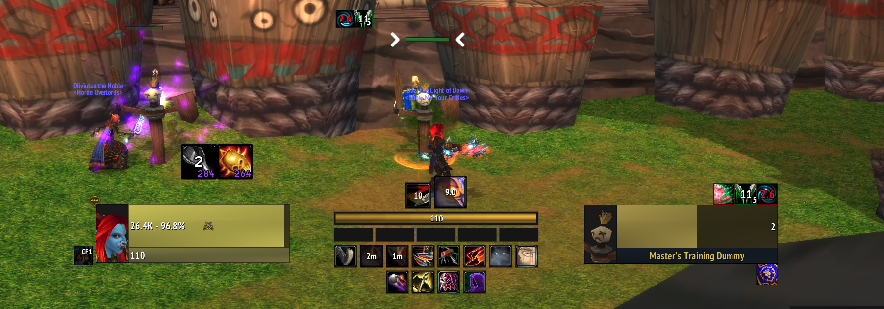
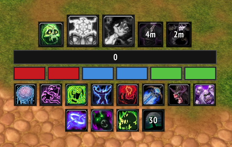
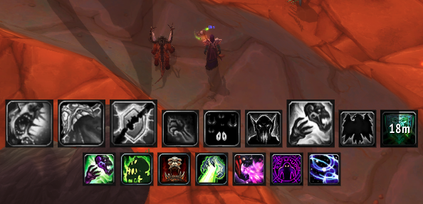

<div align="center">

# Tracker

**A modular class HUD for World of Warcraft 3.3.5a (WotLK)**

One tiny core, one config per class. Stop watching your action bars — watch the fight.


</div>

---

## What is this?

**Tracker** is a lightweight, class-specific heads-up display for WotLK 3.3.5a.
It puts the handful of things you actually react to — procs, DoTs, cooldowns,
resources — into one compact cluster near the center of your screen, and gets
out of the way when nothing is happening.

It is built as **one shared engine plus a small config file per class**:

- **`TrackerCore`** — always loaded. Owns spellbook scanning, aura lookup,
  the icon factory, glow/blink drivers, layout, the 10 Hz refresh loop,
  events and the shared `/tracker` command.
- **`<Class>Tracker`** — a `LoadOnDemand` module that only declares *what* to
  track. The core loads the one matching your class at login, so rogue code
  never runs on a death knight.

Add a new class by dropping in a single table — no engine changes required.

```
                        ┌───────────────────────────┐
                        │        TrackerCore        │
                        │  engine · layout · auras  │
                        │  icons · glow · /tracker  │
                        └─────────────┬─────────────┘
                                      │ LoadAddOn(class)
        ┌──────────┬──────────┬───────┼───────┬──────────┬──────────┐
        ▼          ▼          ▼       ▼       ▼          ▼          ▼
      Rogue       DK       Hunter   Mage   Priest    Warrior    Warlock   Druid
      (config)  (config)  (config) (config)(config)  (config)   (config) (config)
```

## Screenshots

<div align="center">

**In the world — resource bar, secondary row and cooldowns at a glance**



**Close up — runes, runic power and grayscale upkeep reminders**



**Cooldowns with proc glow and remaining time**



</div>

---

## Features

- **Class-aware, talent-aware.** Every entry is filtered through
  `IsSpellKnown`, so talents you never specced simply never appear — and the
  list survives a respec. One Fire/Arcane mage module, one Affliction/Destro/Demo
  warlock module.
- **Smart auras.** DoTs and debuffs show on the target with a top-to-bottom
  cooldown sweep (ElvUI nameplate style).
  `playerOnly` entries only count *your* copy, so another caster's Corruption
  or Serpent Sting never reads as yours.
- **Upkeep reminders.** Maintained effects (`alwaysVisible`) stay in the row and
  desaturate while missing — a glanceable "you forgot to refresh this" cue.
- **Exclusive groups.** One curse at a time? Only the active curse is drawn.
- **Proc glow & blink.** Cooldowns and procs glow when ready and blink as they
  come off cooldown (`glowWhenReady`, `blinkThreshold`).
- **Resource & secondary bars.** Rage, mana, energy, runic power — plus combo
  points and color-coded death knight runes.
- **Draggable & scalable.** Unlock, drag anywhere, lock for click-through, and
  scale from 0.5 to 2.0. Position and scale are saved per character.
- **Shared command.** One `/tracker` entry point for every class.

## Supported classes

| Class | Spec focus | Resource | Secondary | Extra |
|-------|------------|----------|-----------|-------|
| Rogue | Combat / Assassination | Energy | Combo points | Missing poison warning |
| Death Knight | Unholy | Runic Power | 6 runes (typed) | Missing Horn of Winter |
| Hunter | Marksmanship | Mana | — | Missing Trueshot / Dragonhawk |
| Mage | Fire & Arcane | — | — | Arcane Blast stacks, procs |
| Priest | Shadow | — | — | Shadow Weaving stacks, DoTs |
| Warrior | Fury | Rage | — | Flurry / Sunder stacks |
| Warlock | Affliction / Destro / Demo | — | — | Curse group, DoT upkeep |
| Druid | Balance | — | — | Eclipse (Solar/Lunar), DoTs |

## Installation

1. Copy the addon folders into your client:
   `World of Warcraft/Interface/AddOns/`
2. Make sure the **entire folder** is copied (each addon is its own directory,
   with a `.toc` inside).
3. Restart the client (or `/reload`) and log in.

Folders to install:

```
Interface/AddOns/
├── TrackerCore/          (required)
├── RogueTracker/         (one or more class modules)
├── DKTracker/
├── DruidTracker/
├── HunterTracker/
├── MageTracker/
├── PriestTracker/
├── WarriorTracker/
└── WarlockTracker/
```

> Only your class module loads at runtime — the rest sit idle on disk.

## Commands

Everything is under the single `/tracker` command:

| Command | What it does |
|---------|--------------|
| `/tracker unlock` | Unlock the HUD and drag it where you want |
| `/tracker lock` | Lock it in place and enable click-through |
| `/tracker reset` | Snap back to the default center position |
| `/tracker` | Show the command help |

## Adding a class

A class tracker is a single `RegisterModule` call. The core does the rest:

```lua
TrackerCore:RegisterModule({
    addonName  = "RogueTracker",
    dbName     = "RogueTrackerDB",
    className  = "ROGUE",
    printColor = "|cff00ff00",

    cooldowns = {
        { name = "Kick", icon = "Interface\\Icons\\Ability_Kick", glowWhenReady = true },
        -- ...
    },
    abilities = {
        { name = "Rupture", icon = "Interface\\Icons\\Ability_Rogue_Rupture",
          size = 46, alwaysVisible = true, playerOnly = true },
        -- ...
    },

    resource = { powerType = 3, max = 100, color = { 1, 0.8, 0.2 }, height = 18 },
    secondary = { type = "combo", count = 5, height = 18 },

    point = { "CENTER", 0, -100 },
    scale = 1.0,
})
```

Useful per-entry options:

| Option | Effect |
|--------|--------|
| `spellID` | Match the aura by ID (more reliable than name) |
| `size` | Draw this icon larger |
| `alwaysShow` | Build the icon for a proc that is not in the spellbook |
| `alwaysVisible` | Keep the slot visible and grayscale while missing |
| `showCount` | Print the aura stack count on the icon |
| `playerOnly` | Only count auras you cast |
| `group` | Mutually-exclusive auras (only the active one shows) |
| `altAuras` | Match another class's aura with the same effect |
| `glowWhenReady` | Glow the cooldown when it is available |

Register the class token in the `MODULES` table in `TrackerCore.lua` and add a
`.toc` with `## LoadOnDemand: 1` and `## Dependencies: TrackerCore`.

## Notes

- Built and tuned for **WotLK 3.3.5a**, `Interface: 30300`.
- Each module behaves the same on every class thanks to the shared `/tracker`.
- The core owns `TrackerCoreDB`; per-class saved variables are adopted on first
  run so existing layouts are preserved.

---

<div align="center">

Made for the 3.3.5a community.

</div>
